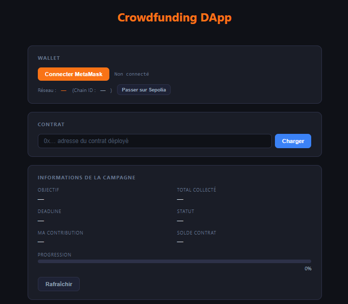
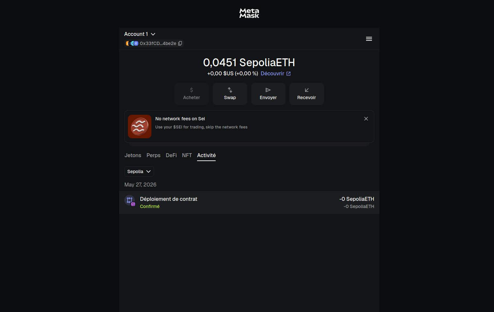
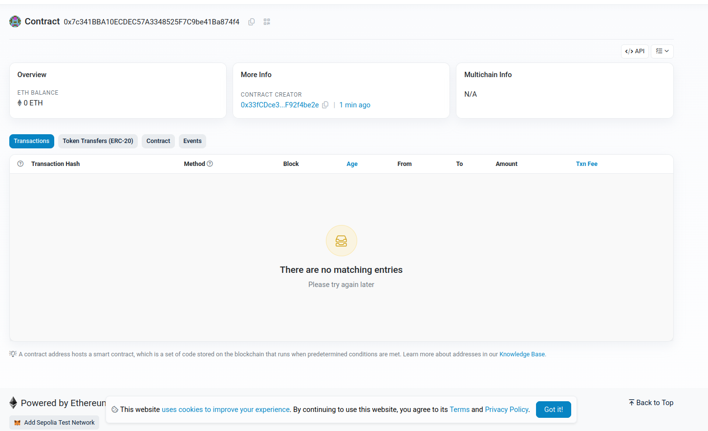

# FundChain - DApp de Crowdfunding Décentralisée

## Vue d'ensemble

FundChain est une application de crowdfunding décentralisée construite autour d'un smart contract Ethereum et d'une interface web interactive. Le projet permet aux utilisateurs de connecter MetaMask, de charger un contrat de crowdfunding déployé sur Sepolia, de contribuer en ETH avant la date limite d'une campagne, de retirer les fonds en tant que propriétaire lorsque l'objectif est atteint, et de demander un remboursement lorsque la campagne se termine sans atteindre son objectif.

L'application est conçue pour le réseau de test Ethereum Sepolia. Le frontend communique directement avec le smart contract au moyen de `ethers.js` et MetaMask.

## Fonctionnalités

- Connexion d'un wallet MetaMask depuis l'interface web.
- Affichage de l'adresse du wallet connecté.
- Affichage du réseau blockchain courant et du chain ID.
- Bouton permettant de basculer MetaMask vers le réseau de test Sepolia.
- Chargement manuel de l'adresse d'un contrat de crowdfunding déployé.
- Tableau de bord de campagne en lecture seule :
  - objectif de financement ;
  - montant total collecté ;
  - deadline ;
  - statut de la campagne ;
  - contribution de l'utilisateur connecté ;
  - solde du smart contract ;
  - barre de progression de la campagne.
- Contribution en ETH via la fonction `contribute()` du smart contract.
- Retrait des fonds par le propriétaire via la fonction `withdraw()`.
- Remboursement des contributeurs via la fonction `refund()`.
- Écoute des événements :
  - `Contributed` ;
  - `Withdrawn` ;
  - `Refunded`.
- Affichage des logs de transactions et d'erreurs dans l'interface.
- Gestion des changements de compte MetaMask.
- Gestion des changements de réseau MetaMask par rechargement de la page.
- Fichiers ABI et bytecode compilés inclus dans le dossier `build/`.

## Smart Contract

Le smart contract principal se trouve dans `contracts/Crowdfunding.sol`.

Le contrat est documenté avec le format NatSpec de Solidity. La présence de cette documentation peut être vérifiée directement dans le fichier source grâce aux balises `/// @title`, `/// @notice`, `/// @dev`, `/// @param` et `/// @return`.

### Variables d'état

- `owner` : adresse immutable du propriétaire de la campagne. Elle est définie avec `msg.sender` lors du déploiement du contrat.
- `goal` : objectif de financement immutable, défini lors du déploiement.
- `deadline` : timestamp immutable de fin de campagne, calculé à partir du moment du déploiement et de `_durationInDays`.
- `totalRaised` : montant total contribué à la campagne.
- `contributions` : mapping qui stocke le montant contribué par chaque adresse.
- `withdrawn` : booléen indiquant si le propriétaire a déjà retiré les fonds.

### Constructeur

Le constructeur reçoit :

- `_goal` : objectif de financement de la campagne.
- `_durationInDays` : durée de la campagne en jours.

Il vérifie que les deux valeurs sont strictement supérieures à zéro, puis initialise `owner`, `goal` et `deadline`.

### `contribute()`

`contribute()` est une fonction externe et payable qui permet aux utilisateurs d'envoyer de l'ETH à la campagne avant la deadline.

Vérifications implémentées :

- la campagne doit encore être active ;
- le montant de la contribution doit être supérieur à zéro.

Effets :

- augmente `contributions[msg.sender]` ;
- augmente `totalRaised` ;
- émet l'événement `Contributed`.

### `withdraw()`

`withdraw()` permet au propriétaire de la campagne de retirer le solde du contrat après la deadline si l'objectif de financement a été atteint.

Vérifications implémentées :

- seul le propriétaire peut appeler la fonction ;
- la deadline doit être passée ;
- les fonds ne doivent pas déjà avoir été retirés ;
- `totalRaised` doit être supérieur ou égal à `goal` ;
- le solde du contrat doit être supérieur à zéro ;
- le transfert d'ETH vers le propriétaire doit réussir.

Effets :

- définit `withdrawn` à `true` ;
- transfère le solde du contrat au propriétaire ;
- émet l'événement `Withdrawn`.

### `refund()`

`refund()` permet aux contributeurs de récupérer leur contribution après la deadline si l'objectif de financement n'a pas été atteint.

Vérifications implémentées :

- la deadline doit être passée ;
- `totalRaised` doit être inférieur à `goal` ;
- l'appelant doit avoir une contribution supérieure à zéro ;
- le transfert d'ETH vers l'appelant doit réussir.

Effets :

- remet la contribution de l'appelant à zéro ;
- diminue `totalRaised` ;
- transfère le montant remboursable à l'appelant ;
- émet l'événement `Refunded`.

### `getCampaignInfo()`

`getCampaignInfo()` est une fonction de lecture qui retourne les informations agrégées de la campagne :

- propriétaire de la campagne ;
- objectif de la campagne ;
- deadline de la campagne ;
- montant total collecté ;
- solde du contrat ;
- état indiquant si l'objectif est atteint ;
- état indiquant si la campagne est terminée ;
- état indiquant si les fonds ont été retirés.

### Événements

- `Contributed(address indexed contributor, uint256 amount)`
- `Withdrawn(address indexed recipient, uint256 amount)`
- `Refunded(address indexed contributor, uint256 amount)`

### Modifiers

- `onlyOwner` : limite l'exécution d'une fonction au propriétaire de la campagne.
- `beforeDeadline` : autorise l'exécution uniquement avant la deadline de la campagne.
- `afterDeadline` : autorise l'exécution uniquement après ou au moment de la deadline.

### Mécanismes de sécurité

- Utilisation de Solidity `^0.8.20`, qui inclut des vérifications natives contre les dépassements arithmétiques.
- Validation des paramètres du constructeur afin d'éviter un objectif nul ou une campagne de durée nulle.
- Contrôle d'accès sur `withdraw()` via le modifier `onlyOwner`.
- Restrictions temporelles via `beforeDeadline` et `afterDeadline`.
- Interdiction des contributions de valeur nulle.
- Prévention du double retrait grâce au booléen `withdrawn`.
- Application du modèle checks-effects-interactions dans `withdraw()` et `refund()`.
- Réinitialisation du solde du contributeur avant le transfert lors d'un remboursement.
- Transferts d'ETH effectués avec `call` et vérification explicite du booléen de succès.
- Documentation NatSpec présente dans `contracts/Crowdfunding.sol` pour décrire le contrat, ses paramètres, ses valeurs de retour et ses fonctions principales.

## Frontend

Le frontend se trouve dans le dossier `front/`. Il est implémenté comme une application web statique en HTML, CSS et JavaScript, avec une logique d'interaction blockchain centralisée dans `front/app.js`.

`front/index.html` définit l'interface utilisateur, notamment :

- panneau de connexion du wallet ;
- affichage du réseau et bouton de passage vers Sepolia ;
- champ de saisie de l'adresse du contrat ;
- tableau de bord des informations de la campagne ;
- barre de progression ;
- champ de contribution ;
- boutons de retrait et de remboursement ;
- zone de logs des transactions.

`front/app.js` contient la logique applicative :

- initialise un `ethers.providers.Web3Provider` à partir de MetaMask ;
- récupère le signer connecté ;
- crée une instance `ethers.Contract` à partir de l'adresse du contrat et de l'ABI embarquée ;
- lit les informations de la campagne avec `getCampaignInfo()` ;
- lit la contribution de l'utilisateur connecté avec `contributions(address)` ;
- envoie les transactions pour `contribute()`, `withdraw()` et `refund()` ;
- écoute les événements du contrat et rafraîchit l'interface après les mises à jour ;
- gère les changements de compte et de réseau MetaMask.

Le frontend utilise `ethers.js` version `5.7.2`, chargé depuis un CDN.

## Intégration Blockchain

L'intégration blockchain est implémentée avec `ethers.js` et MetaMask.

L'application utilise MetaMask comme provider injecté via `window.ethereum`. Lorsque l'utilisateur connecte son wallet, le frontend crée :

- un provider avec `new ethers.providers.Web3Provider(window.ethereum)` ;
- un signer avec `provider.getSigner()` ;
- une instance de contrat avec `new ethers.Contract(contractAddress, CONTRACT_ABI, signer || provider)`.

Les opérations de lecture sont effectuées via le provider ou l'instance de contrat associée au signer. Les opérations d'écriture nécessitent un signer connecté et déclenchent une confirmation de transaction dans MetaMask.

Le frontend est configuré pour fonctionner avec le réseau de test Sepolia :

- chain ID Sepolia : `11155111` ;
- chain ID hexadécimal : `0xaa36a7` ;
- URL RPC utilisée lors de l'ajout du réseau : `https://rpc.sepolia.org` ;
- explorateur de blocs : `https://sepolia.etherscan.io`.

## Structure du projet

```text
.
|-- .gitattributes
|-- README.md
|-- S14_Mini_Projet.pdf
|-- build
|   |-- contracts_Crowdfunding_sol_Crowdfunding.abi
|   `-- contracts_Crowdfunding_sol_Crowdfunding.bin
|-- contracts
|   `-- Crowdfunding.sol
|-- front
|   |-- app.js
|   `-- index.html
|-- screenshots
|   |--  Scénario 2 — Refus contribution après deadline.png
|   |-- Etherscan.png
|   |-- MetaMask.png
|   |-- Scénario 1 — Contribution avant deadline .png
|   |-- Scénario 3 — Withdraw si objectif atteint.png
|   |-- Scénario 4 — Refus withdraw si objectif non atteint .png
|   |-- Scénario 5 — Refund si objectif non atteint .png
|   `-- Scénario 6 — Refus refund si objectif atteint .png
`-- test-solc
    |-- build
    |   |-- contracts_Test_sol_Test.abi
    |   `-- contracts_Test_sol_Test.bin
    `-- contracts
        `-- Test.sol
```

## Installation

Le frontend est une application web statique composée de `front/index.html` et `front/app.js`. Il peut être lancé localement avec un serveur statique simple.

Prérequis :

- MetaMask installé dans le navigateur ;
- un compte configuré sur le réseau Sepolia ;
- une connexion internet pour charger `ethers.js` depuis le CDN ;
- l'adresse du smart contract `Crowdfunding` déployé sur Sepolia.

Étapes de lancement :

1. Cloner ou télécharger le repository.
2. Ouvrir un terminal à la racine du projet.
3. Se placer dans le dossier `front/`.
4. Servir le dossier avec un serveur statique local.

Exemple avec Python :

```bash
cd front
python -m http.server 8000
```

Puis ouvrir l'application dans le navigateur :

```text
http://localhost:8000
```

Une fois l'interface ouverte, l'utilisateur peut connecter MetaMask, passer sur Sepolia, saisir l'adresse du contrat et interagir avec la campagne.

## Utilisation

1. Ouvrir le frontend dans un navigateur avec MetaMask installé.
2. Cliquer sur `Connecter MetaMask`.
3. Approuver la connexion du wallet dans MetaMask.
4. Passer sur Sepolia avec le bouton `Passer sur Sepolia` si nécessaire.
5. Saisir l'adresse du smart contract déployé dans le champ prévu à cet effet.
6. Cliquer sur `Charger`.
7. Consulter les informations de la campagne affichées dans le tableau de bord.
8. Pour contribuer, saisir un montant en ETH puis cliquer sur `Contribuer`.
9. Après la deadline de la campagne :
   - le propriétaire peut appeler `Withdraw (owner)` si l'objectif a été atteint ;
   - les contributeurs peuvent appeler `Refund` si l'objectif n'a pas été atteint.

## Déploiement du Smart Contract

Le smart contract `Crowdfunding.sol` est destiné à être déployé sur le réseau de test Sepolia, par exemple avec Remix. Après déploiement, l'adresse du contrat doit être renseignée ci-dessous et utilisée dans l'interface frontend.

Contract Address:
`0x65A2027E7bDdcB889340FA3795095F9c4ae1FcE0`

Etherscan:
`https://sepolia.etherscan.io/address/0x65A2027E7bDdcB889340FA3795095F9c4ae1FcE0`

## Captures d'écran

### Frontend

#### Interface principale

Cette capture présente l'interface principale de la DApp avec les informations de campagne et les actions utilisateur.



#### Scénario 1 - Contribution avant deadline

Cette capture montre une contribution acceptée avant la date limite de la campagne.


#### Scénario 2 - Refus contribution après deadline

Cette capture montre le refus d'une contribution lorsque la campagne est déjà terminée.


#### Scénario 3 - Withdraw si objectif atteint

Cette capture montre le retrait des fonds par le propriétaire lorsque l'objectif de financement est atteint.


#### Scénario 4 - Refus withdraw si objectif non atteint

Cette capture montre le refus du retrait lorsque l'objectif de financement n'est pas atteint.


#### Scénario 5 - Refund si objectif non atteint

Cette capture montre le remboursement d'un contributeur lorsque l'objectif de financement n'est pas atteint.


#### Scénario 6 - Refus refund si objectif atteint

Cette capture montre le refus du remboursement lorsque l'objectif de financement a été atteint.


### MetaMask

Cette capture montre l'interaction avec MetaMask lors de l'utilisation de la DApp.



### Etherscan

Cette capture montre les informations du contrat ou d'une transaction consultées sur Sepolia Etherscan.



## Considérations de sécurité

Le smart contract applique plusieurs mécanismes de sécurité adaptés au fonctionnement d'une campagne de crowdfunding :

- les paramètres de la campagne sont validés au déploiement ;
- les contributions sont acceptées uniquement avant la deadline ;
- les retraits et remboursements sont autorisés uniquement après la deadline ;
- seul le propriétaire peut retirer les fonds ;
- le retrait nécessite que l'objectif de financement soit atteint ;
- le remboursement nécessite que l'objectif de financement ne soit pas atteint ;
- les contributeurs ne peuvent pas se faire rembourser plus que leur contribution enregistrée ;
- le solde de contribution est réinitialisé avant le transfert de remboursement ;
- le retrait ne peut être effectué qu'une seule fois ;
- le succès des transferts est vérifié explicitement.

## Vidéo de démonstration

Lien de la vidéo :
[Vidéo de démonstration](https://drive.google.com/file/d/19a0j3iJUrEDMzWZ5c61rHDPEdQ6D_kyp/view?usp=sharing)
